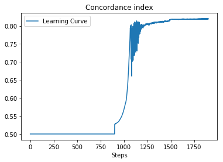

# TFDeepSurv
Deep Cox proportional risk model and survival analysis implemented by tensorflow.

## 1. Differences from DeepSurv
[DeepSurv](https://github.com/jaredleekatzman/DeepSurv), a package also used for Deep Cox proportional risk model, is published on Github. But our works may differ in:

- Evaluating importance of features in neural network.
- Automatically processing ties of death time in you data, which means different loss function and estimator for survival function (`Breslow` or `Efron` approximation).
- Calculating survival function and three estimation ways are provided.
- Tuning hyperparameters of DNN using scientific method - Bayesian Hyperparameters Optimization.

## 2. Statement
The project is based on research of Breast Cancer. The paper about this project has been submitted to IEEE JBHI. We will update status here once paper published !

## 3. Installation
### From source

Download TFDeepSurv package and install from the directory (**Python version : 3.x**):
```bash
git clone https://github.com/liupei101/TFDeepSurv.git
cd TFDeepSurv
pip install .
```

## 4. Get it started:

### 4.1 Runing with simulated data
#### import packages and prepare data
```python
# import package
from tfdeepsurv import dsl
from tfdeepsurv.dataset import SimulatedData
# generate simulated data
# train data : 2000 rows, 10 features, 2 related features
data_config = SimulatedData(2000, num_var = 2, num_features = 10)
train_data = data_config.generate_data(2000)
# test data : 800 rows
test_data = data_config.generate_data(800)
```

#### Build your neural network
```python
input_nodes = 10
output_nodes = 1
train_X = train_data['x']
train_y = {'e': train_data['e'], 't': train_data['t']}
model = dsl.dsnn(
    train_X, train_y,
    input_nodes, [6, 3], output_nodes, 
    learning_rate=0.2,
    learning_rate_decay=1.0,
    activation='relu', 
    L1_reg=0.0002, 
    L2_reg=0.0003, 
    optimizer='adam',
    dropout_keep_prob=1.0
)
# Watch if ties occur
# 'noties', 'breslow' when ties occur or 'efron' when ties occur frequently
print(model.get_ties())
```

#### Train neural network model
```python
# Plot curve of loss and CI on train data
model.train(num_epoch=2500, iteration=100,
            plot_train_loss=True, plot_train_ci=True)
```

result :
```
-------------------------------------------------
training steps 1:
loss = 7.08086.
CI = 0.532591.
-------------------------------------------------
training steps 101:
loss = 7.0803.
CI = 0.557864.
-------------------------------------------------
training steps 201:
loss = 7.07884.
CI = 0.591186.
...
...
...
-------------------------------------------------
training steps 2201:
loss = 6.29935.
CI = 0.81826.
-------------------------------------------------
training steps 2301:
loss = 6.30067.
CI = 0.818013.
-------------------------------------------------
training steps 2401:
loss = 6.29985.
CI = 0.818038.
```
Curve of loss and CI:

Loss Value                       | CI
:-------------------------------:|:--------------------------------------:
|

#### evaluate model on data of train and test :
```python
test_X = test_data['x']
test_y = {'e': test_data['e'], 't': test_data['t']}
print("CI on train set: %g" % model.score(train_X, train_y))
print("CI on test set: %g" % model.score(test_X, test_y))
```
result :
```
CI on train set: 0.819224
CI on test set: 0.817987
```

#### evaluate importance of features
```python
model.get_vip_byweights()
```
result:
```
0th feature score : -0.157754.
1th feature score : 1.
2th feature score : -0.0505626.
3th feature score : -0.0559399.
4th feature score : 0.0426953.
5th feature score : 0.0687309.
6th feature score : 0.00604751.
7th feature score : 0.0584479.
8th feature score : -0.100448.
9th feature score : 0.00362639.
```

#### estimation of survival function
```python
# algo: 'wwe', 'bls' or 'kp', the algorithm for estimating survival function
model.survival_function(test_X[0:3], algo="wwe")
```

result:


### 4.2 Runing with real data
The procedure on real data is similar with the described on simulated data. One we need to notice is data preparation. This package provides functions for loading standard dataset for traning or testing.

#### load real data
```python
# import package
from tfdeepsurv import dsl
from tfdeepsurv.utils import load_data

# Notice: the object train_X or test_X returned from function load_data is numpy.array.
# the object train_y or test_y returned from function load_data is dict like {'e': numpy.array,'t': numpy.array}.

# load training data and testing data, respectively
train_X, train_y = load_data('train.csv', excluded_col=['ID'], surv_col={'e': 'event', 't': 'time'})
test_X, test_y = load_data('test.csv', excluded_col=['ID'], surv_col={'e': 'event', 't': 'time'})
# or load full data, then split it into training and testing set (=8:2).
train_X, train_y, test_X, test_y = load_data('full_data.csv', excluded_col=['ID'], surv_col={'e': 'event', 't': 'time'}, split_ratio=0.8)
```

### Traning and testing tfdeepsurv model
This is the same as doing in simulated data.

## 5. More properties
We provide tools for hyperparameters tuning of Bayesian Hyperparameters Optimization for neural network, which is convenient and automatic for tuning hyperparameters.

For more usage of Bayesian Hyperparameters Optimization, you can refer to [here](bysopt/README.md)